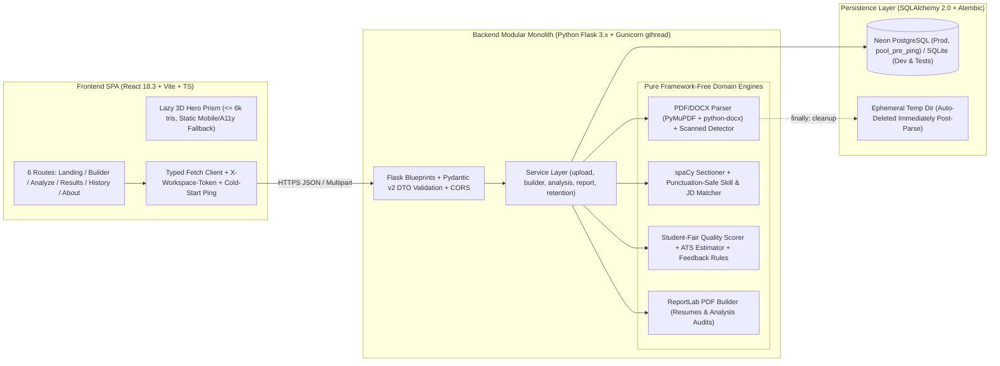
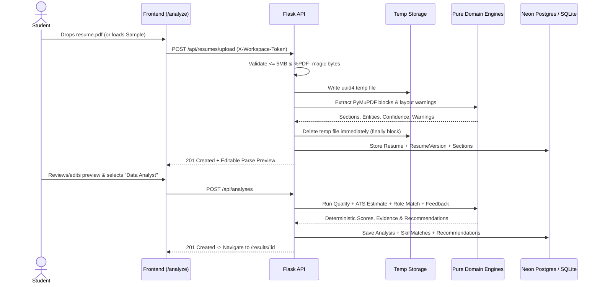

# System Architecture & Sequence Diagrams

---

## 1. Component Architecture (Flask Modular Monolith + React SPA)

```mermaid
flowchart LR
    subgraph Client["Frontend SPA (React 18.3 + Vite + TS)"]
        UI["6 Routes: Landing / Builder / Analyze / Results / History / About"]
        R3F["Lazy 3D Hero Prism (<= 6k tris, Static Mobile/A11y Fallback)"]
        API_Client["Typed Fetch Client + X-Workspace-Token + Cold-Start Ping"]
    end

    subgraph Server["Backend Modular Monolith (Python Flask 3.x + Gunicorn gthread)"]
        Routes["Flask Blueprints + Pydantic v2 DTO Validation + CORS"]
        Svc["Service Layer (upload, builder, analysis, report, retention)"]
        subgraph Domain["Pure Framework-Free Domain Engines"]
            Parser["PDF/DOCX Parser (PyMuPDF + python-docx) + Scanned Detector"]
            NLP["spaCy Sectioner + Punctuation-Safe Skill & JD Matcher"]
            Scorer["Student-Fair Quality Scorer + ATS Estimator + Feedback Rules"]
            PDFGen["ReportLab PDF Builder (Resumes & Analysis Audits)"]
        end
    end

    subgraph Storage["Persistence Layer (SQLAlchemy 2.0 + Alembic)"]
        DB[("Neon PostgreSQL (Prod, pool_pre_ping) / SQLite (Dev & Tests)")]
        Tmp["Ephemeral Temp Dir (Auto-Deleted Immediately Post-Parse)"]
    end

    UI --> API_Client
    API_Client -- "HTTPS JSON / Multipart" --> Routes
    Routes --> Svc
    Svc --> Parser
    Parser -. "finally: cleanup" .-> Tmp
    Svc --> NLP
    Svc --> Scorer
    Svc --> PDFGen
    Svc --> DB
```

---

## 2. Upload, Verify & Analyze Sequence

```mermaid
sequenceDiagram
    actor Student
    participant UI as Frontend (/analyze)
    participant API as Flask API
    participant Tmp as Temp Storage
    participant Engine as Pure Domain Engines
    participant DB as Neon Postgres / SQLite

    Student->>UI: Drops resume.pdf (or loads Sample)
    UI->>API: POST /api/resumes/upload (X-Workspace-Token)
    API->>API: Validate <= 5MB & %PDF- magic bytes
    API->>Tmp: Write uuid4 temp file
    API->>Engine: Extract PyMuPDF blocks & layout warnings
    Engine-->>API: Sections, Entities, Confidence, Warnings
    API->>Tmp: Delete temp file immediately (finally block)
    API->>DB: Store Resume + ResumeVersion + Sections
    API-->>UI: 201 Created + Editable Parse Preview
    Student->>UI: Reviews/edits preview & selects "Data Analyst"
    UI->>API: POST /api/analyses
    API->>Engine: Run Quality + ATS Estimate + Role Match + Feedback
    Engine-->>API: Deterministic Scores, Evidence & Recommendations
    API->>DB: Save Analysis + SkillMatches + Recommendations
    API-->>UI: 201 Created -> Navigate to /results/:id
```
