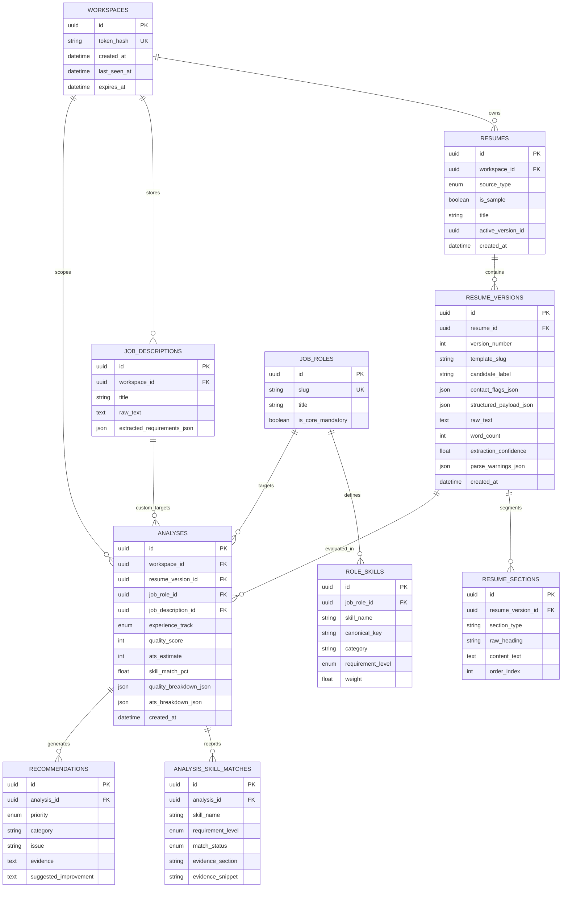

# Entity-Relationship Diagram

```mermaid
erDiagram
    WORKSPACES ||--o{ RESUMES : owns
    WORKSPACES ||--o{ JOB_DESCRIPTIONS : stores
    WORKSPACES ||--o{ ANALYSES : scopes
    RESUMES ||--o{ RESUME_VERSIONS : contains
    RESUME_VERSIONS ||--o{ RESUME_SECTIONS : segments
    RESUME_VERSIONS ||--o{ ANALYSES : evaluated_in
    JOB_ROLES ||--o{ ROLE_SKILLS : defines
    JOB_ROLES ||--o{ ANALYSES : targets
    JOB_DESCRIPTIONS ||--o{ ANALYSES : custom_targets
    ANALYSES ||--o{ ANALYSIS_SKILL_MATCHES : records
    ANALYSES ||--o{ RECOMMENDATIONS : generates

    WORKSPACES {
        uuid id PK
        string token_hash UK
        datetime created_at
        datetime last_seen_at
        datetime expires_at
    }

    RESUMES {
        uuid id PK
        uuid workspace_id FK
        enum source_type
        boolean is_sample
        string title
        uuid active_version_id
        datetime created_at
    }

    RESUME_VERSIONS {
        uuid id PK
        uuid resume_id FK
        int version_number
        string template_slug
        string candidate_label
        json contact_flags_json
        json structured_payload_json
        text raw_text
        int word_count
        float extraction_confidence
        json parse_warnings_json
        datetime created_at
    }

    RESUME_SECTIONS {
        uuid id PK
        uuid resume_version_id FK
        string section_type
        string raw_heading
        text content_text
        int order_index
    }

    JOB_ROLES {
        uuid id PK
        string slug UK
        string title
        boolean is_core_mandatory
    }

    ROLE_SKILLS {
        uuid id PK
        uuid job_role_id FK
        string skill_name
        string canonical_key
        string category
        enum requirement_level
        float weight
    }

    JOB_DESCRIPTIONS {
        uuid id PK
        uuid workspace_id FK
        string title
        text raw_text
        json extracted_requirements_json
    }

    ANALYSES {
        uuid id PK
        uuid workspace_id FK
        uuid resume_version_id FK
        uuid job_role_id FK
        uuid job_description_id FK
        enum experience_track
        int quality_score
        int ats_estimate
        float skill_match_pct
        json quality_breakdown_json
        json ats_breakdown_json
        datetime created_at
    }

    ANALYSIS_SKILL_MATCHES {
        uuid id PK
        uuid analysis_id FK
        string skill_name
        enum requirement_level
        enum match_status
        string evidence_section
        string evidence_snippet
    }

    RECOMMENDATIONS {
        uuid id PK
        uuid analysis_id FK
        enum priority
        string category
        string issue
        text evidence
        text suggested_improvement
    }
```
